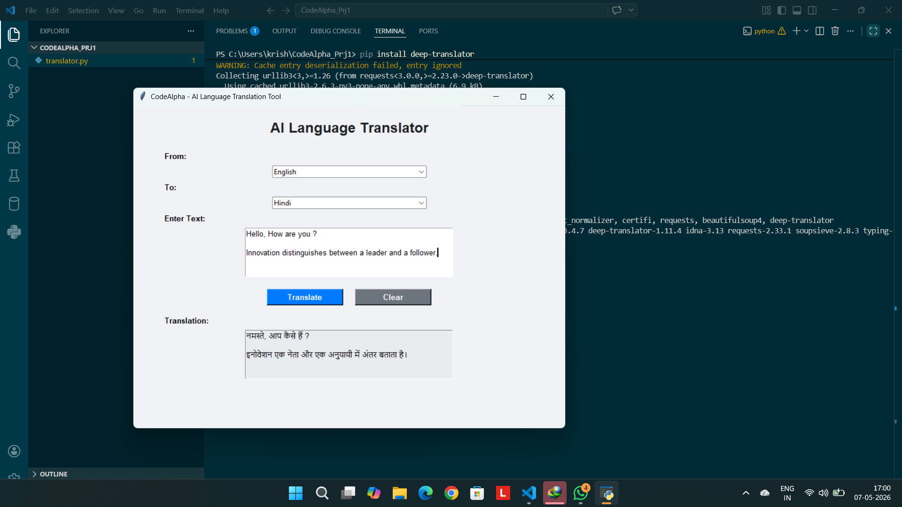

# AI Language Translation Tool - CodeAlpha

This is a real-time Language Translation Tool developed as part of my **Artificial Intelligence Internship at CodeAlpha**. The application provides a user-friendly interface to translate text between multiple languages instantly.

## 🚀 Features
* **User Interface:** Built using Python's Tkinter library.
* **Stable Translation:** Uses the `deep-translator` library for reliable API connection.
* **Multi-Language Support:** Supports English, Hindi, Spanish, French, German, Arabic, and more.
* **Clear Functionality:** One-click clear button for easy re-typing.

## 🛠️ Tech Stack
* **Language:** Python 3.x
* **GUI Library:** Tkinter
* **Translation API:** Google Translator (via deep-translator)

## 📋 How to Run
1. Clone this repository or download the files.
2. Install the required libraries:
   ```bash
   pip install -r requirements.txt



**Developed by:** [Krishna Kashyap](https://www.linkedin.com/in/krishna-kashyap-4513a1327?utm_source=share_via&utm_content=profile&utm_medium=member_android)